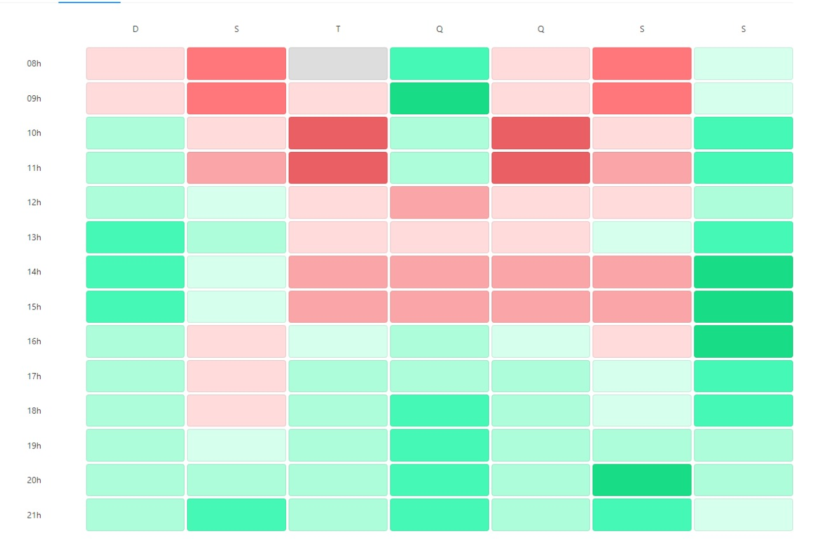
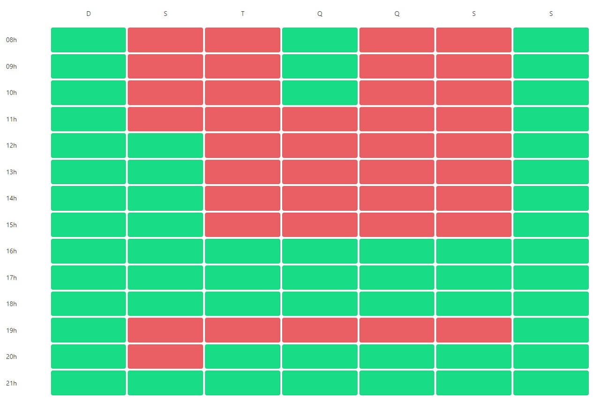
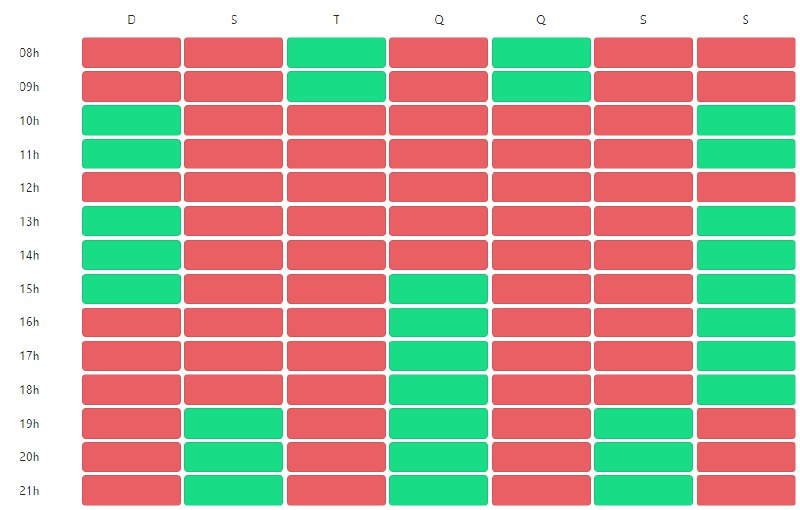
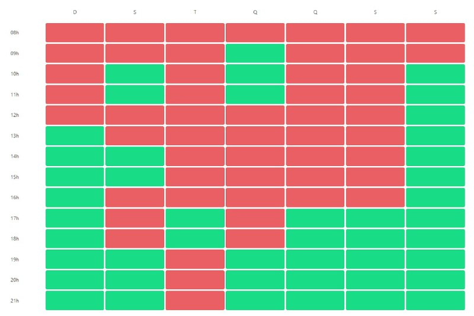
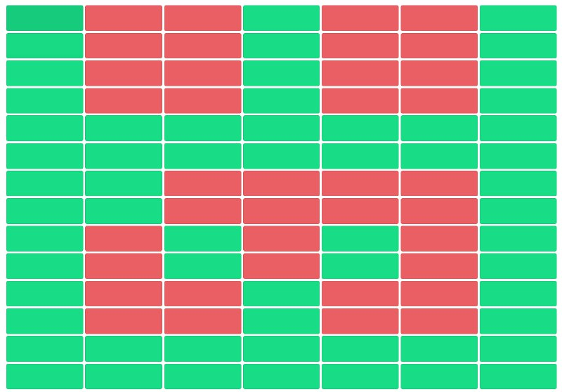
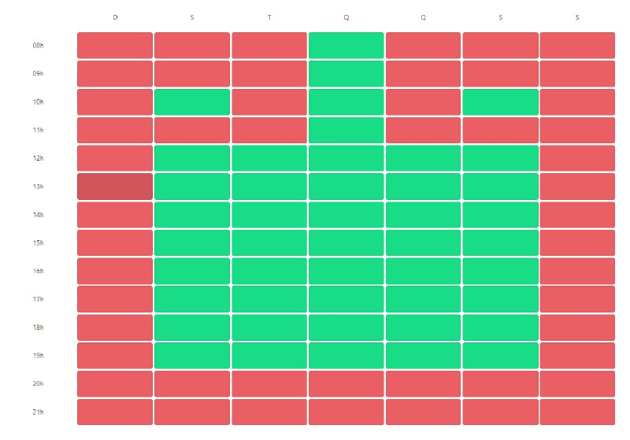
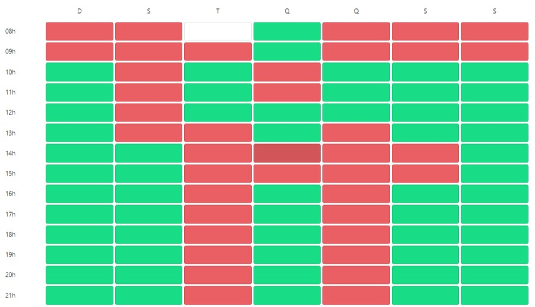
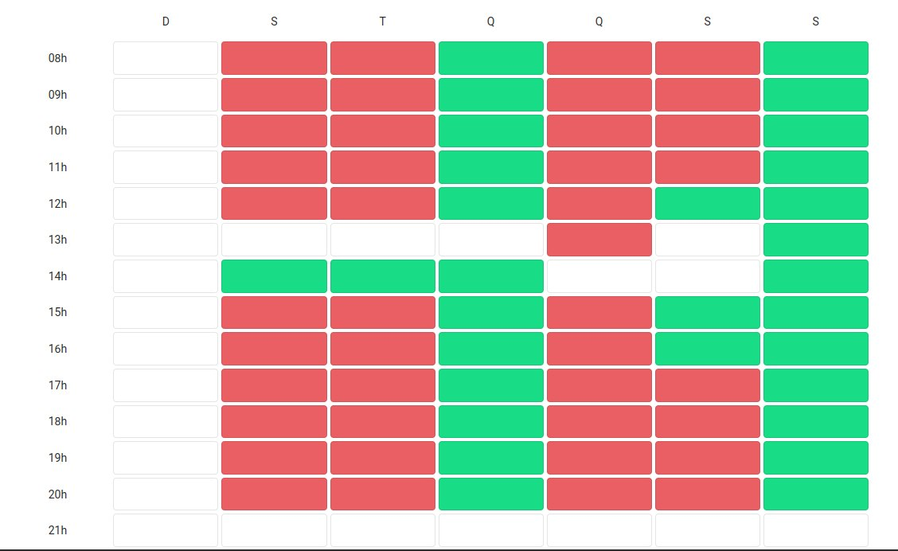
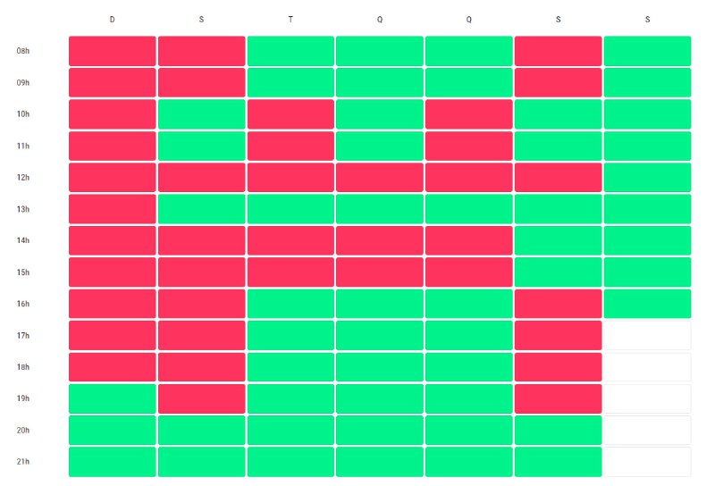
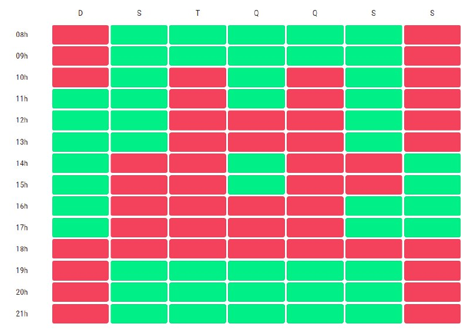

# Heatmap

## Histórico de versões
| Data     | Versão | Descrição            | Autor(a)                                     | Revisor(a)                             |
| -------- | ------ | -------------------- | -------------------------------------------- | -------------------------------------- |
| 20.06.22 | 1.0    | Criação do documento | [Amanda Nobre](https://github.com/AmandaNbr) | [Lucas Braun](https://github.com/lbvx) |

## Introdução

Heatmap significa "mapa de calor" e serve para mapear várias métricas atráves de cores. No contexto da equipe, serve como guia para os horários dos integrantes. Essa técnica normalmente é feita no começo de projetos para facilitar a escolha de horários em comum para reuniões e pareamentos.

## Metodologia

A equipe utilizou a aplicação que um colega de equipe está desenvolvendo chamada [Bora Marcar](https://boramarcar.vercel.app/), cada um preenche uma grade com vermelho (ocupado) ou verde (livre) e é gerada uma grade de horários final que informa os melhores dias, quem está ocupado e quem está disponível.

## Participantes

- [Amanda Nobre](https://github.com/AmandaNbr)
- [Ana Carolina](https://github.com/AnaCarolinaRodriguesLeite)
- [Irwin Schmitt](https://github.com/irwinschmitt)
- [Lucas Braun](https://github.com/lbvx)
- [Mateus Maia](https://github.com/mateusmaiamaia)
- [Matheus Calixto](https://github.com/matheuscvp)
- [Matheus Fonseca](https://github.com/gatotabaco) 
- [Matheus Monteiro](https://github.com/matheusyanmonteiro)
- [Thaís Rebouças](https://github.com/thais-ra)
- [Yudi Yamane](https://github.com/yudi-azvd)

## Resultados

### Heatmap final

  

 
Figura 1 - Heatmap da Equipe  
Fonte: Gerado pelo Bora Marcar

### Heatmaps individuais

  

 
Figura 2 - Heatmap Amanda  
Fonte: Gerado pelo Bora Marcar

  

 
Figura 3 - Heatmap Ana  
Fonte: Gerado pelo Bora Marcar

  

 
Figura 4 - Heatmap Irwin  
Fonte: Gerado pelo Bora Marcar

  

 
Figura 5 - Heatmap Lucas  
Fonte: Gerado pelo Bora Marcar

  

 
Figura 6 - Heatmap Mateus Cunha  
Fonte: Gerado pelo Bora Marcar

  

 
Figura 7 - Heatmap Matheus Calixto  
Fonte: Gerado pelo Bora Marcar

  

 
Figura 8 - Heatmap Matheus Fonseca  
Fonte: Gerado pelo Bora Marcar

  

 
Figura 9 - Heatmap Matheus Monteiro  
Fonte: Gerado pelo Bora Marcar

  

 
Figura 10 - Heatmap Thaís  
Fonte: Gerado pelo Bora Marcar

  

 
Figura 11 - Heatmap Yudi  
Fonte: Gerado pelo Bora Marcar

## Referências

Heat map. Disponível em: <https://en.wikipedia.org/wiki/Heat_map> Acesso em: 20 de junho de 2022