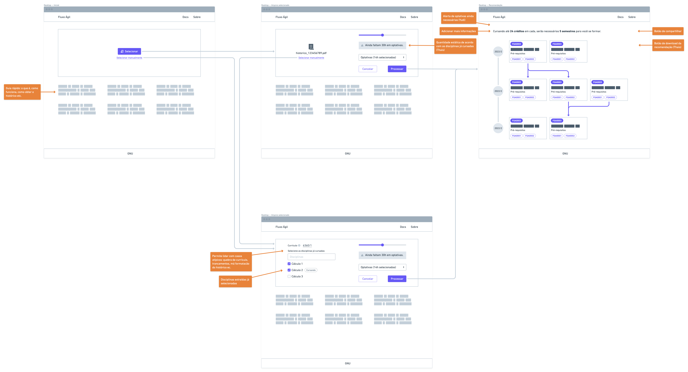

# Protótipo de Média Fidelidade

## Histórico de versões

| Data       | Versão | Descrição            | Autor(a)                                         | Revisor(a)                                      |
| ---------- | ------ | -------------------- | ------------------------------------------------ | ----------------------------------------------- |
| 27/06/2022 | 1.0    | Criação do protótipo | [Irwin Schmitt](https://github.com/irwinschmitt) | [Mateus Calixto](https://github.com/matheuscvp) |

## Introdução

O protótipo de média fidelidade, também conhecido como _wireframe_, é utilizado para validar a interatividade com a interface, priorizando o fluxo de navegação.

## Metodologia

O protótipo de média fidelidade foi criado utilizando a aplicação [Whimsical](https://whimsical.com/) em duas versões: a primeira para obtermos uma visão geral do fluxo e outra como um refinamento a partir dos requisitos elicitados que possuem a maior prioridade. Para essa etapa, os elementos visuais, como cores e tipografia, não são relevantes.

## Participantes

- [Irwin Schmitt](https://github.com/irwinschmitt)

## Protótipo

O protótipo pode ser acessado através do [link](https://whimsical.com/fluxo-agil-VR3ZVKAJR17wAwkG7jAV1u).

### Versão 1

Figura 1 - Versão 1 do Protótipo de Média Fidelidade  
Autor: Irwin Schmitt

### Versão 2

Para essa segunda versão, entende-se que há apenas um fluxo: a seleção de disciplinas cursadas, e o envio do histórico é apenas uma forma de agilizar o fluxo para o usuário.

<iframe style="border:none" width="800" height="450" src="https://whimsical.com/embed/VR3ZVKAJR17wAwkG7jAV1u@7YNFXnKbYi8SMQMETWd51"></iframe>

Figura 2 - Versão 2 do Protótipo de Média Fidelidade  
Autor: Irwin Schmitt

## Referências

Whimsical. Disponível em https://whimsical.com. Acesso em 17 de Junho de 2022.
