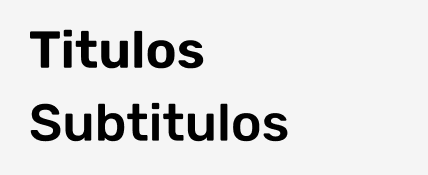
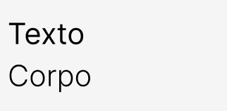
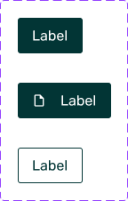
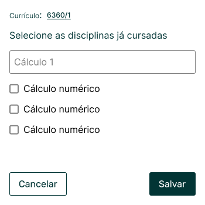

# Guia de Estilo

## Histórico de versões
| Data       | Versão | Descrição              | Autor(a)                                         | Revisor(a)                                       |
| ---------- | ------ | ---------------------- | ------------------------------------------------ | ------------------------------------------------ |
| 25.06.2022 | 1.0    | Criação do documento   | [Matheus Calixto](https://github.com/matheuscvp) | [Mateus Maia](https://github.com/mateusmaiamaia) |
| 26.06.2022 | 1.1    | Adição dos componentes | [Matheus Calixto](https://github.com/matheuscvp) | [Mateus Maia](https://github.com/mateusmaiamaia) |

## Introdução

Este documento descreve o guia de estilo utilizado no projeto.

## Metodologia

Para a criação do guia de estilo, foi feito a escolha da paleta de cores e fontes a serem utilizada no projeto.

## Participantes

- [Irwin Schmitt](https://github.com/irwinschmitt)
- [Matheus Calixto](https://github.com/matheuscvp)

## Paleta de cores

A paleta de cores escolhida foi:

 
Figura 1 - Paleta de cores  
Fonte: <a href="https://color.adobe.com/pt/explore">Adobe Color</a>

## Fontes

As fontes escolhidas foram:

### Fonte Rubik

A fonte Rubik - <a href="https://fonts.google.com/specimen/Rubik">Google Fonts</a>
Será utilizada em titulos e Sub Titulos, nos pesos semibold, medium e regular, no tamanho de 20px.
Exemplo:

 
Figura 2 - exemplo Rubik  
Fonte: Autores

### Fonte Inter

A fonte Inter - <a href="https://fonts.google.com/specimen/Inter">Google Fonts</a>
Será utilizada em textos e corpo, nos pesos regular e light, no tamanho de 16px.

 
Figura 3 - exemplo Inter  
Fonte: Autores

## Componentes

Aqui serão mostrados os componentes a serem utilizados no projeto, que foram confecionados utilizando o [Figma](https://www.figma.com/).

### Header

 
Figura 4 - Header  
Fonte: Autores

### Footer

 
Figura 5 - Footer  
Fonte: Autores

### Botões

 
Figura 6 - Botões  
Fonte: Autores

### Campo de texto

 
Figura 7 - Campo de texto  
Fonte: Autores

### Checkbox

 
Figura 8 - Checkbox  
Fonte: Autores

### Modal

 
Figura 9 - Modal  
Fonte: Autores

### Link

 
Figura 10 - Link  
Fonte: Autores

### Upload

 
Figura 11 - Upload  
Fonte: Autores

## Referências

Adobe Color. Disponível em <a href="https://color.adobe.com/pt/explore">https://color.adobe.com/pt/explore</a>. Acesso em 22 de Junho de 2022  
Figma. Disponível em <a href="https://www.figma.com/">https://www.figma.com/</a>. Acesso em 22 de Junho de 2022  
Google Fonts. Disponível em <a href="https://fonts.google.com">https://fonts.google.com</a>. Acesso em 22 de Junho de 2022