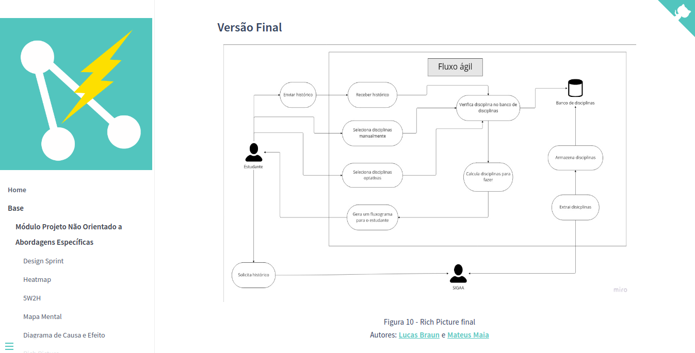
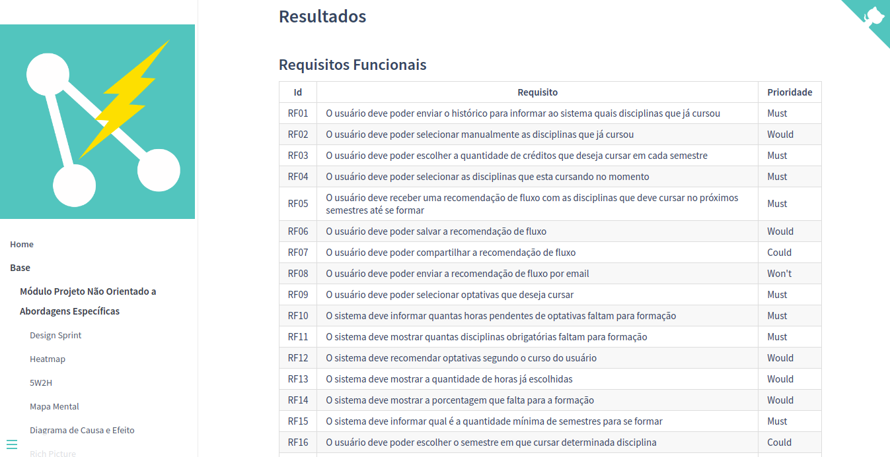

<!--- Logo do Projeto -->

<!--- Esse repositório é para ser utilizado pelos grupos como um template inicial, da home page do Projeto.
As seções do Template NÃO DEVEM SER OMITIDAS, sendo TODAS RELEVANTES.
Demais diretrizes sobre a organização da wiki constam no Moodle Aprender 3.

**!! Atenção: Renomeie o seu repositório para (Ano.Semestre)_(Grupo)_(NomeDoProjeto)*. !!** 

**!! *Não coloque os nomes dos alunos no título do repositório*. !!**

**!! *Exemplo de título correto: 2022.1_G1_ProjetoPandora*. !!** -->
# Fluxo Ágil 

## Sobre o Projeto

**Código da Disciplina**: FGA0208

**Número do Grupo**: 04

**Fluxo Ágil** é um aplicativo que recomenda um fluxo de disciplinas para 
estudantes de graduação da Universidade de Brasília baseado em seu histórico 
acadêmico.

Esse site hospeda a documentação do projeto, diretrizes de desenvolvimento,
decisões de arquitetura, guia de estilo e outros artefatos. Esses artefatos
foram desenvolvido para a disciplina de Arquitetura e Desenho de Software 
ministrada pela professora Milene Serrano na Universidade de Brasília.

<!--
Descreva o seu projeto em linhas gerais.
Use referências, links, que permitam conhecer um pouco mais sobre o projeto. 
-->

## Desenvolvedores

| Matrícula  | Aluno            | Username GitHub                                                           |
| ---------- | ---------------- | ------------------------------------------------------------------------- |
| 19/0124997 | Amanda Nobre     | [AmandaNbr](https://github.com/AmandaNbr)                                 |
| 19/0101792 | Ana Carolina     | [AnaCarolinaRodriguesLeite](https://github.com/AnaCarolinaRodriguesLeite) |
| 17/0105342 | Irwin Schmitt    | [irwinschmitt](https://github.com/irwinschmitt)                           |
| 19/0033088 | Lucas Braun      | [lbvx](https://github.com/lbvx)                                           |
| 18/0106805 | Mateus Maia      | [mateusmaiamaia](https://github.com/mateusmaiamaia)                       |
| 19/0055201 | Matheus Calixto  | [matheuscvp](https://github.com/matheuscvp)                               |
| 17/0111059 | Matheus Fonseca  | [gatotabaco](https://github.com/gatotabaco)                               |
| 18/0127969 | Matheus Monteiro | [matheusyanmonteiro](https://github.com/matheusyanmonteiro)               |
| 18/0078224 | Thaís Rebouças   | [thais-ra](https://github.com/thais-ra)                                   |
| 16/0149410 | Yudi Yamane      | [yudi-azvd](https://github.com/yudi-azvd)                                 |

## Screenshots Primeira Entrega <<FOCO: DSW(Base)>>

 
Figura 1 - Protótipo de alta fidelidade  
Fonte: Figma da equipe

 
 

 
Figura 2 - Rich Picture final  
Fonte: <a href="https://unbarqdsw2022-1.github.io/2022.1_G4_FluxoAgil/#/Base/AbordagemNaoEspecifica/rich_picture?id=vers%c3%a3o-final">Site da documentação</a>

 
Figura 3 - Requisitos depois da priorização MoSCoW  
Fonte: <a href="http://localhost:3000/#/Base/AbordagemNaoEspecifica/priorizacao/moscow?id=resultados">Site da documentação</a>

## Screenshots Segunda Entrega <<FOCO: DSW(Modelagem)>>

 
Figura 4 - Diagrama de classes  
Fonte: <a href="https://unbarqdsw2022-1.github.io/2022.1_G4_FluxoAgil/#/Modelagem/diagrama-classes?id=resultados">Site da documentação</a>

 
Figura 4 - Diagrama de atividades  
Fonte: <a href="https://unbarqdsw2022-1.github.io/2022.1_G4_FluxoAgil/#/Modelagem/UMLDinamicos/diagramaDeAtividade">Site da documentação</a>

<!--- 

## Screenshots Terceira Entrega <<FOCO: DSW(Padrões de Projeto)>>
Adicione 2 ou mais screenshots do projeto em termos de artefatos da Terceira Entrega.

## Screenshots Quarta Entrega (FINAL) <<FOCOS: Arquitetura & Reutilização de Software & PROJETO FINAL>>
Adicione 2 ou mais screenshots do projeto em termos de interface e/ou funcionamento.

## Descritivo dos Principais Aspectos Técnicos 
**Principal(is) Metodologia(s) Adotada(s)**: xxxxxx 
**Principais Linguagens Utilizadas e/ou Pretendidas**: xxxxxx 
**Principais Tecnologias Utilizadas e/ou Pretendidas**: xxxxxx 
**Principal(is) Estilo(s) Arquitetural(is) Adotado(s)**: xxxxxx 

## O Projeto está rodando?
( ) SIM
( ) NÃO
Se SIM, insira um manual (ou um script) para auxiliar ainda mais os interessados em consultar o projeto.

## Informações Complementares 
Quaisquer outras informações sobre seu projeto podem ser descritas nessa seção.
