# Título

## Histórico de versões
| Data       | Versão | Descrição            | Autor(a)                                     | Revisor(a)                                    |
| ---------- | ------ | -------------------- | -------------------------------------------- | --------------------------------------------- |
| 19.06.22   | 1.0    | Criação do documento |[Lucas Braun](https://github.com/lbvx) e [Mateus Maia](https://github.com/mateusmaiamaia)  | [Ana Carolina](https://github.com/AnaCarolinaRodriguesLeite) |

## Introdução

O Rich Picture é uma ferramenta efetiva com uma linguagem acessível, em que, se permiti analisar problemas e expressar ideias de maneira simples, por conta de sua notação. Essa ferramenta ajuda no processo de identificação de requisitos e de processos de negócios, os atores do projeto e os relacionamentos e responsabilidades dos atores com os processos.

## Metodologia

A equipe optou por realizar a reunião de maneira remota, por conta dos horários dos membros da equipe e por haver membros do time com o COVID-19. Inicialmente, foi realizado uma reunião com todos os membros da equipe, onde cada membro fez o seu próprio rich picture. Nessa reunião cada membro apresentou o seu próprio artefato e no fim foi decidido os pontos que deveriam estar presentes no artefato final e os responsáveis por realizar esse artefato final.

Foi realizado uma reunião com os membros responsáveis pela elaboração do rich picture final e foi utilizado o rich picture dos outros membros como base para esse resultado final.

## Participantes

- [Amanda Nobre](https://github.com/AmandaNbr)
- [Ana Carolina](https://github.com/AnaCarolinaRodriguesLeite)
- [Irwin Schmitt](https://github.com/irwinschmitt)
- [Lucas Braun](https://github.com/lbvx)
- [Mateus Maia](https://github.com/mateusmaiamaia)
- [Matheus Fonseca](https://github.com/gatotabaco)
- [Matheus Monteiro](https://github.com/matheusyanmonteiro)
- [Matheus Pinheiro](https://github.com/matheuscvp)
- [Thais Rebolça](https://github.com/Thais-ra)
- [Yudi Yamane](https://github.com/yudi-azvd)

## Resultados Individuais

Resultados dos artefatos criados individualmente. 

### Rich Picture 1

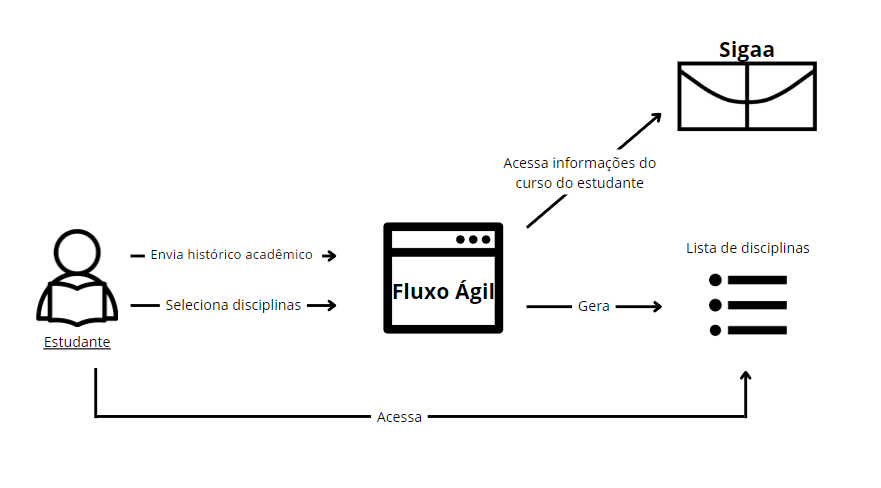

 
Figura 1 - Rich Picture individual  
Autora: Amanda Nobre 

### Rich Picture 2

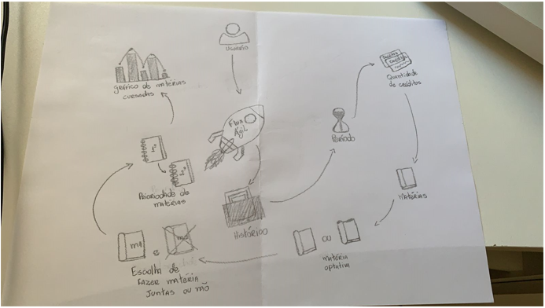

 
Figura 2 - Rich Picture individual  
Autora: Ana Carolina

### Rich Picture 3

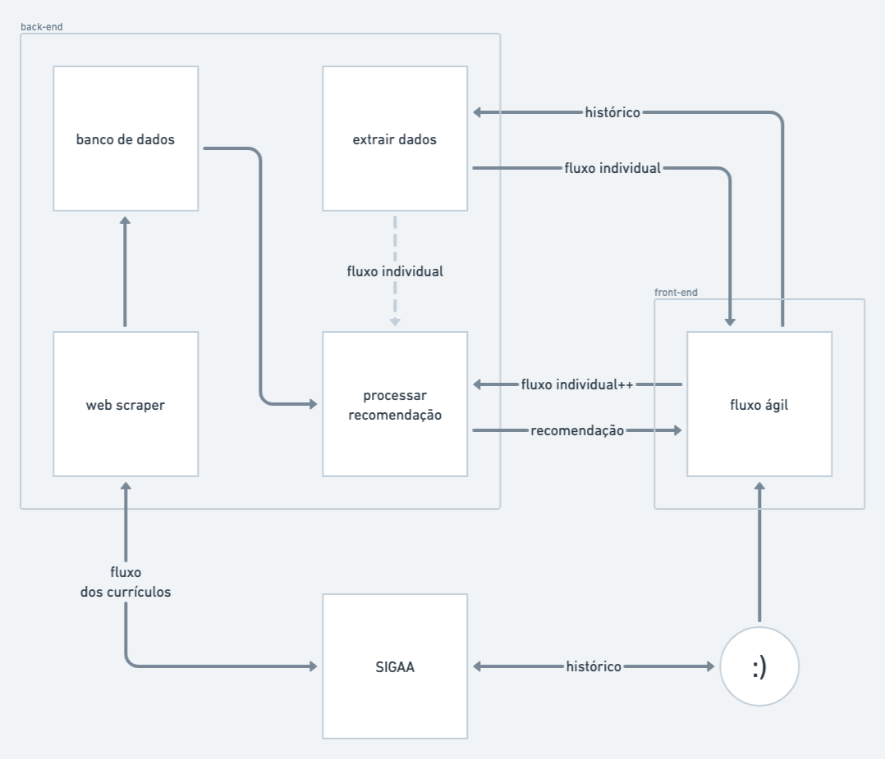

 
Figura 3 - Rich Picture individual  
Autor: Irwin Schmitt

### Rich Picture 4

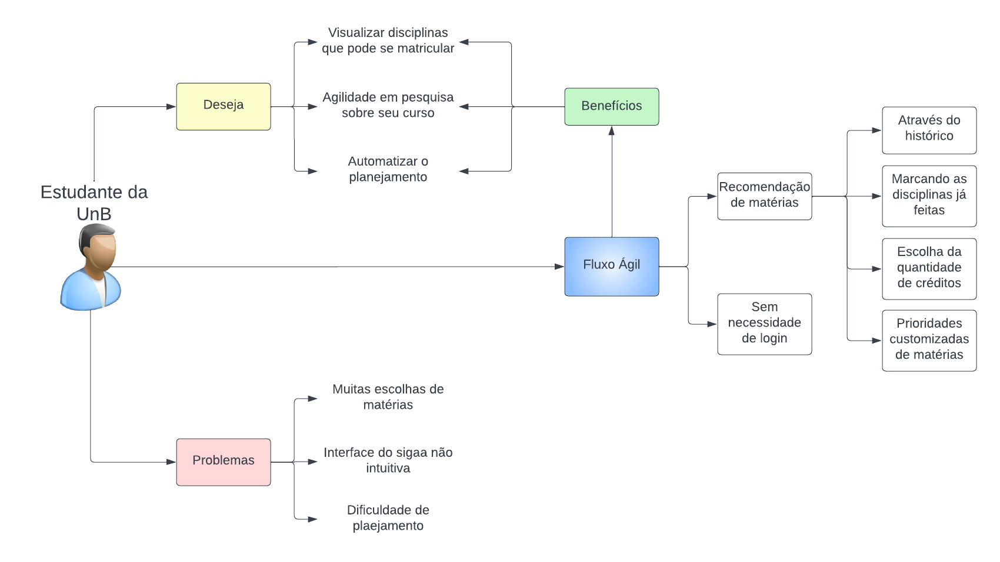

 
Figura 4 - Rich Picture individual  
Autor: Lucas Braun

### Rich Picture 5

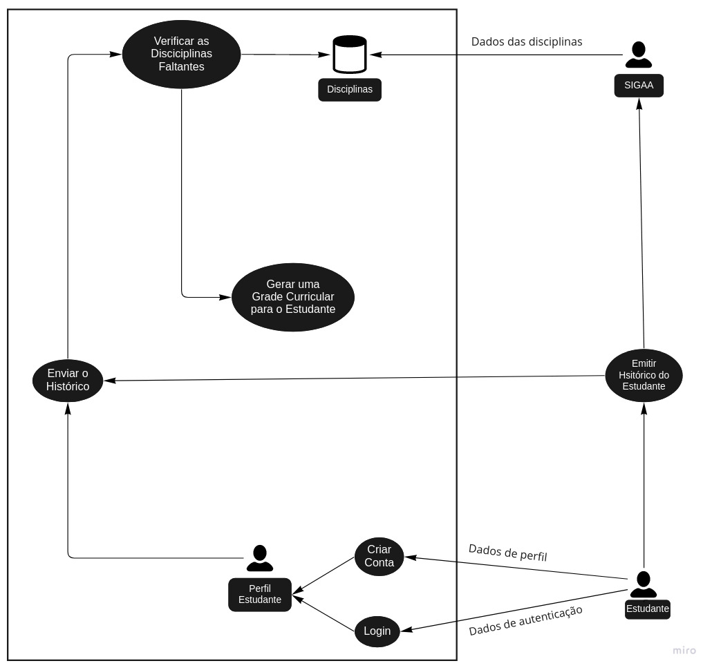

 
Figura 5 - Rich Picture individual  
Autor: Mateus Maia 

### Rich Picture 6

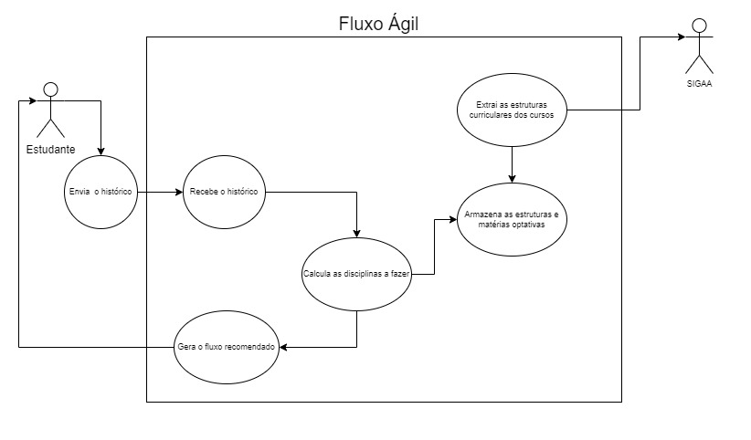

 
Figura 6 - Rich Picture individual  
Autor: Matheus Pinheiro  

### Rich Picture 7

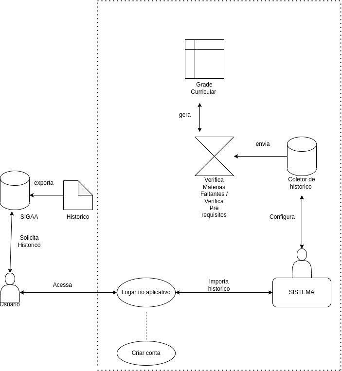

 
Figura 7 - Rich Picture individual  
Autor: Matheus Monteiro 

### Rich Picture 8

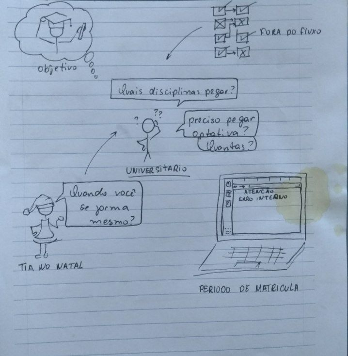

 
Figura 8 - Rich Picture individual  
Autora: Thais Rebolça

### Rich Picture 9

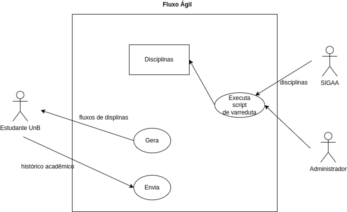

 
Figura 9 - Rich Picture individual  
Autor: Yudi Yamane 

## Resultados Final

Resultado final do artefato criado após a reunião entre os autores do mesmo. 

### Versão Final

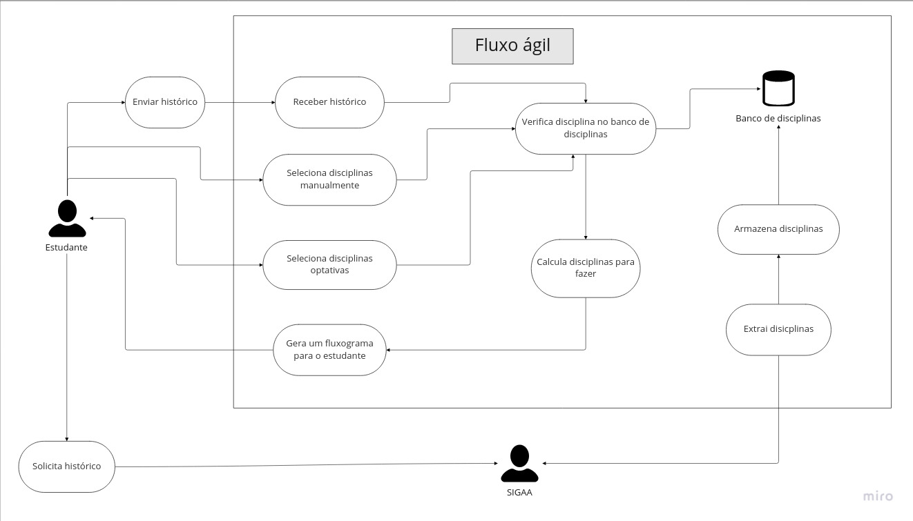

 
Figura 10 - Rich Picture final  
Autores: Lucas Braun e Mateus Maia 

### Legenda da Versão Final

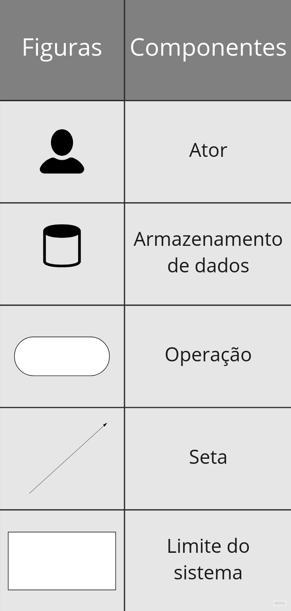

 
Figura 11 - Legenda do Rich Picture final  
Autores: Lucas Braun e Mateus Maia 

## Referências

[1] Leite, Julio Cesar Sampaio do Prado. Livro Vivo - Engenharia de Requisitos. Disponível em: http://livrodeengenhariaderequisitos.blogspot.com.br/

[2] Young, Ralph. Requirements Engineering Handbook. Norwood, US: Artech House Books, 2003.

